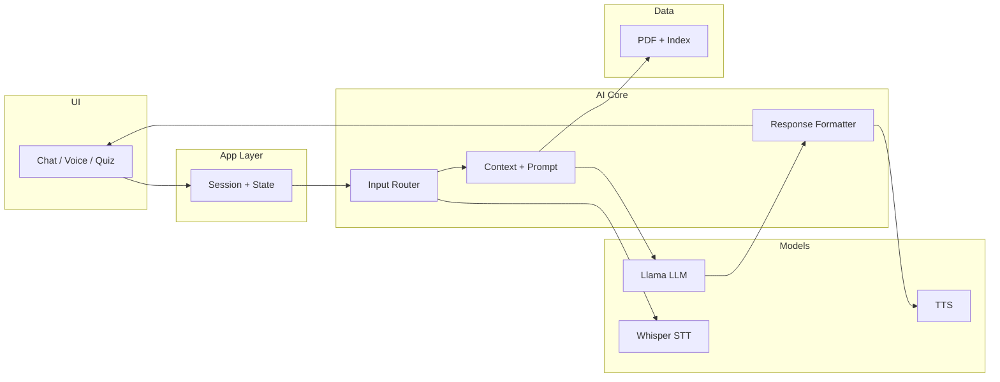
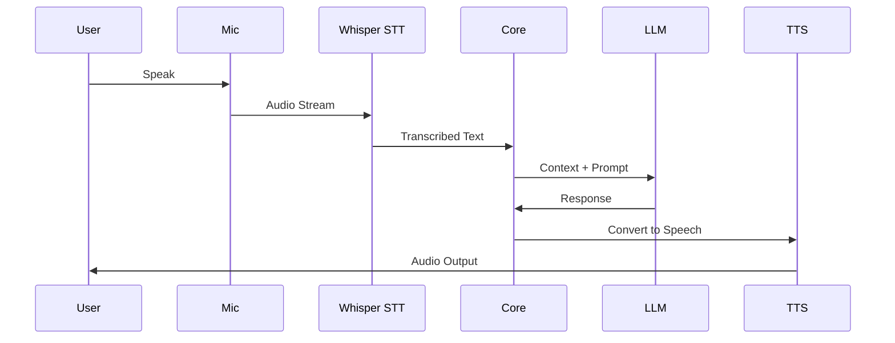

# ThinkMate – Offline AI Study Companion

  

  <b>Talk to your PDFs. Learn faster.</b>

  
  
  
  
  
  

---

##  Overview

**ThinkMate** is a fully offline AI-powered study assistant designed to run entirely on-device.  
It transforms static PDFs into **interactive, conversational learning experiences** using embedded AI models.

Unlike cloud-based systems, ThinkMate ensures:

-  Full data privacy  
-  Real-time responses  
-  Zero dependency on internet connectivity  

---

## 📥 Download

> ⚠️ Requires Android device with minimum 4GB RAM

| Version | Format | Link |
| :--- | :--- | :--- |
| **ThinkMate v1.0.0 (Latest)** | APK |  |

---

##  Motivation

Traditional AI learning tools suffer from:

- Dependence on cloud APIs  
- Privacy concerns with sensitive study material  
- Poor personalization for user-provided documents  
- Latency in real-time interaction  

**ThinkMate addresses these limitations by deploying a complete AI pipeline locally.**

---

##  Core Capabilities

###  Document Intelligence
- Local PDF parsing and semantic chunking  
- Context-aware retrieval system  
- Persistent on-device document memory  

---

###  Voice-Driven Interaction
- Continuous conversation mode  
- Whisper-based offline speech recognition  
- Real-time conversational feedback  

---

###  Concept Simplification
- Structured breakdown of complex ideas  
- Step-by-step reasoning  
- Analogy-driven explanations  

---

###  Adaptive Quiz Engine
- Auto-generated MCQs from source material  
- Instant grading and feedback  
- Explanation-first learning approach  

---

## 🛠️ Tech Stack

| Layer | Technology |
|------|-----------|
| Frontend | Flutter |
| AI Runtime | RunAnywhere |
| LLM | Llama 3.2 |
| Speech-to-Text | Whisper |
| Text-to-Speech | Mimic |
| State Management | Provider |
| Storage | Local Cache |

---
##  System Architecture

## PDF Processing Pipeline

## Voice Interaction Loop (Real-Time)

## Runtime Execution Model
Single-device orchestration
Async processing across:
Audio pipeline
LLM inference
UI rendering
Memory-aware execution:
Chunked inference
Cached embeddings
No external API dependency

##  Key Design Principles
1. On-Device First
All computation happens locally:
Eliminates latency
Guarantees privacy

2. Modular AI Pipeline
Each component is isolated:
STT, LLM, TTS are independent
Easy to upgrade models

3. Context-Grounded AI
No hallucination-prone open responses
Strict document-based answering

4. Streaming Interaction (Planned)
Real-time token streaming
Continuous voice loop

## 🚀 Why This Architecture Stands Out

Most projects:

Use APIs
Have shallow pipelines
Lack real orchestration

ThinkMate instead implements:

Full offline AI stack
Multi-model coordination
Real-time voice + reasoning loop
Embedded document intelligence

---
